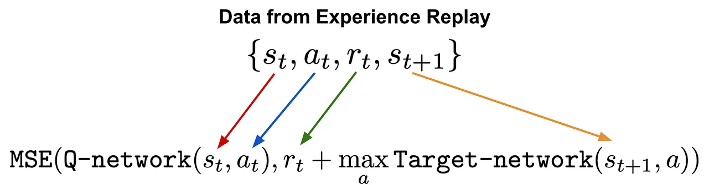

# Reinforcement Learning: Q learning

References:

- [rezaborhani's blog: Q-Learning](https://rezaborhani.github.io/mlr/blog_posts/Reinforcement_Learning/Q_learning.html)
- [Q-Learning Guide: Begin with Reinforcement Learning Basics](https://www.simplilearn.com/tutorials/machine-learning-tutorial/what-is-q-learning)
- [Wikipedia: Q-learning](https://en.wikipedia.org/wiki/Q-learning)
- [Mathematical Foundations of Reinforcement Learning](https://github.com/MathFoundationRL/Book-Mathematical-Foundation-of-Reinforcement-Learning)
  - [Lu, Yukuan: Q Learning](https://lyk-love.cn/2024/06/22/q-learning/)

Resources:

## Q Learning

Ref:

- Christopher Watkins and Peter Dayan, Q-learning, Machine learning, 8.3-4, 1992, 279-292. [pdf](https://www.gatsby.ucl.ac.uk/~dayan/papers/cjch.pdf), [errata](https://www.gatsby.ucl.ac.uk/~dayan/papers/cjcherr.pdf)

### Algorithm

1. 初始化所有状态-动作对 (state-action pairs) 的 Q 值 $Q(s, a)$ (根据实现的策略，可以使用随机值或者服从某些分布)
2. 进行迭代算法 (For life or until learning is stopped)
   1. 根据当前 Q 值估计 (Q-value estimates) $Q(s, \cdot)$ 在当前世界状态 ($s$) 中选择一个动作 ($a$)。
   2. 执行动作 ($a$) 并观察结果状态 ($s’$) 和奖励 ($r)。
   3. 对真实 Q 值进行更新 $Q' (s, a) := Q(s,a) + \alpha [r + \gamma\max_{\substack a'} Q (s', a') - Q(s, a)]$

<!-- 

source: [DataCamp - An Introduction to Q-Learning: A Tutorial For Beginners](https://www.datacamp.com/tutorial/introduction-q-learning-beginner-tutorial) -->

## Q Table

Q Table <-> Pair of (State space, Action) $(s_i, a_j)$

## Update process

$$
\begin{align}
Q_{t+1}(s_t, a_t)
&\gets Q_t(s_t, a_t) + \alpha_t ( r_{t+1} + \gamma \cdot \max_{a \in \mathcal A_{s_{t+1}}} Q_t( s_{t+1} , a) - Q_t (s_{t+1}, a_t)) \\
&= (1 - \alpha)Q(s_t, a_t) + \alpha r_{t+1} + \alpha \gamma \max_{a \in \mathcal A_{s_{t+1}}} Q_t( s_{t+1} , a)
\end{align}
$$

核心概念

- Action Value function $Q(s, a)$ (价值函数)
  - 当前状态 $s$ 下执行行动 $a$ 的 $Q$ 值。
- $s'$ <-> $s_{t+1}$
  - next state, **predicated**
  - 是执行行动 $a$ 后的新状态。
- Learning rate $\alpha$ (学习率)
  - A factor determining how much new information overrides old information.
  - A higher learning rate means the agent learns faster, updating its Q-values more significantly with new rewards and experiences.
  - 学习率，决定了**新获得**的信息对现有 Q 值的影响程度。
- Discounting rate $\gamma$ (衰减因子)
  - This factor discounts the value of future rewards compared to immediate rewards.
  - A higher discount factor means that future rewards are more valuable, encouraging long-term beneficial actions over short-term gains.
  - 折扣因子，用于平衡即时奖励和未来奖励的重要性。
- $R_{t+1}$ <-> $R(s_t \to s_{t+1}, a_t)$
  - 是执行行动 $a_t$ 后，从 $s_t$ 转换到 $s_{t+1}$ 所获得的即时奖励。
- Epsilon-Greedy Strategy $\varepsilon$ (贪婪策略因子)

$Q_{t+1}(s_t, a_t)$ is the sum of three parts:

1. $(1 - \alpha)Q(s_t, a_t)$: the current value (weighted by one minus the learning rate)
2. $\alpha r_{t+1}$: The reward $r_{t+1}$ to obtain if action $a_t$ is taken when in State $s_t$ (weighted by learning rate)
3. $\max_{a \in \mathcal A_{s_{t+1}}} Q_t( s_{t+1} , a)$: the maximum reward that can be obtained from state $s_{t+1}$ (weighted by learning rate and discount factor)

What we learn actually?

**Policy $\pi$**

- The policy determines what action to take in each state and can be derived from the Q-values.
- Typically, **the policy chooses the action with the highest Q-value in each state (exploitation)**, though sometimes a less optimal action is chosen for exploration purposes.

### Image illustration

source: [DataCamp - An Introduction to Q-Learning: A Tutorial For Beginners](https://www.datacamp.com/tutorial/introduction-q-learning-beginner-tutorial): Author Thomas Simonini

source: [Q-learning - Wikipedia](https://en.wikipedia.org/wiki/Q-learning)

source: [\[RL\] Q learning 與 Deep Q Network(DQN)](https://hackmd.io/@YungHuiHsu/BJgnMHbUH6)

## $\varepsilon$-greedy 策略的工作原理

## Bellman equation (贝尔曼方程)

The Bellman equation is a fundamental concept in dynamic programming and reinforcement learning. Essentially, the Bellman equation breaks down the decision-making problem into smaller, manageable subproblems and then combines their solutions to determine the optimal policy.

$$
\mathbb{E}[R_t|s_t=s] = \sum_{a}\pi(a|s)\sum_{s'}P(s'|s,a)\left[R(s,a,s') + \gamma V(s') \right]
$$

## 附录 (Appendix)

绘制 Q-table 或奖励曲线

## Frozen Lake

What we cares?

- Step to reach the goal
- Pr(state, action) <-> Q Table
