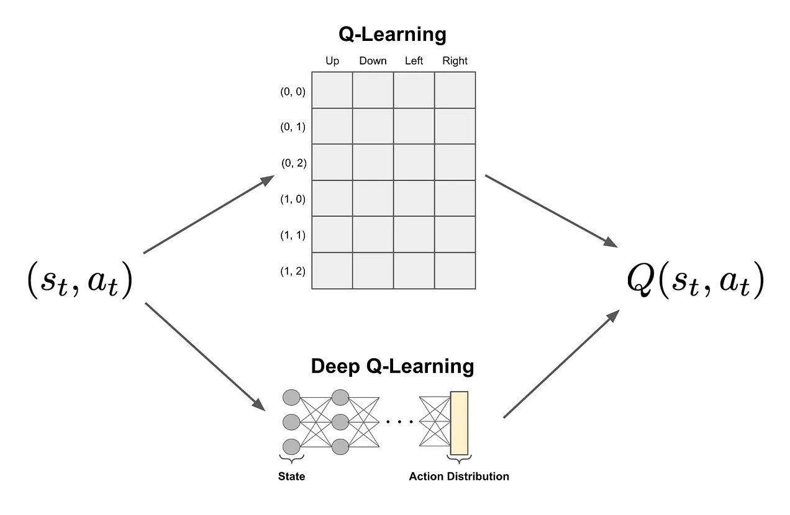

# Deep Q Learning

在传统的 Q learning 中，Q 值是从一个状态和一个行动计算出来的，并且通常是通过查表或者简单的函数来实现的。但当状态和行动的数量非常大时，这种方法变得不可行。

source: [\[RL\] Q learning 與 Deep Q Network(DQN)](https://hackmd.io/@YungHuiHsu/BJgnMHbUH6)

source: [\[RL\] Q learning 與 Deep Q Network(DQN)](https://hackmd.io/@YungHuiHsu/BJgnMHbUH6)
