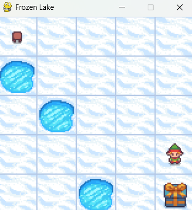
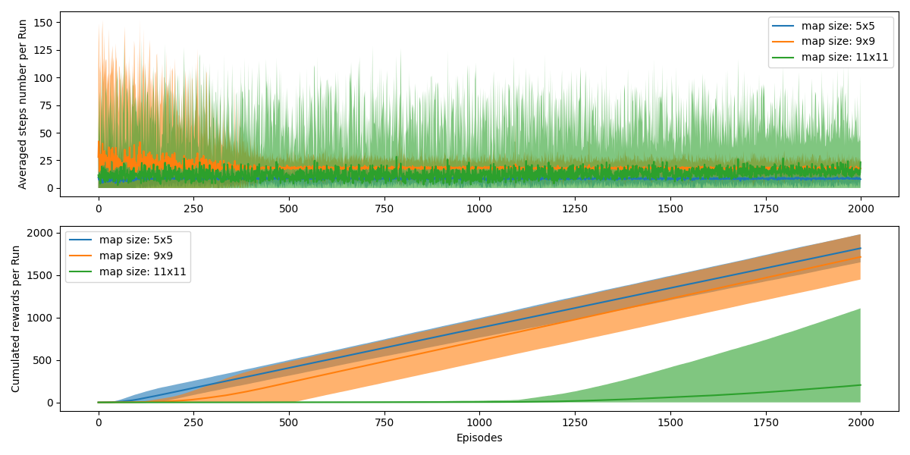
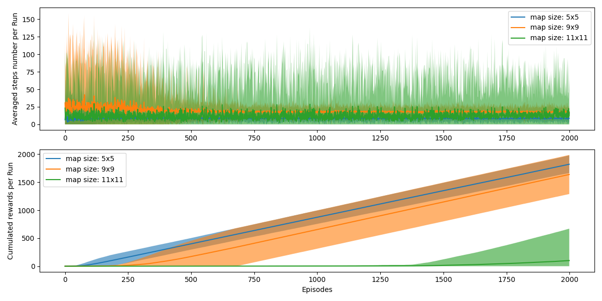

# Homework 1 Report

Submitted by: Cong Fu (@congfu)

## Q1: 仔细阅读整个代码库, 找出目前已有的实现里面, 如何体现 Q learning 的 update formula。把 update formula 拆解成不同的部分, 把源代码中相应的部分粘贴过来。

Q-learning 的更新公式如下：

$$
Q_{t+1} (s_t, a_t) := Q_t(s_t, a_t) + \alpha [r_{t+1} + \gamma\max_{\substack a'} Q(s_{t+1}, a_{t+1}) - Q_t(Q_{t+1}, a_t)]
$$

对应于代码中：

1. 首先

```python
from smolrl.agents import QLearningAgent
```

导入了 Qlearning 的算法。

2. 训练的 agent

```python
agent = QLearningAgent(
    learning_rate=params.learning_rate,
    gamma=params.gamma,
    epsilon=params.epsilon,
    obs_space=env.observation_space,
    action_space=env.action_space,
)
```

3. 更新 Q 值的方法：

```python
agent.update(state, action, reward, new_state)
```

4. 更新公式的每一项代码具体实现 (in `q_learning.py`):

当前的 Q 值 $Q_t(s_t, a_t)$:

    self.qfunc.get_q_value(state, action)

学习率 $\alpha$:

    self.learning_rate

奖励 $r$:

    reward 参数

衰减因子 $\gamma$:

    self.gamma

新状态的最大 Q 值 $\max_{\substack a'} Q(s_{t+1})$:

    self.qfunc.max_q_prime(new_state)

目标值：

    reward + self.gamma * self.qfunc.max_q_prime(new_state)

查资料代码里的 $\delta$ 是时序差分误差，表示预测值与目标值的差：

```
delta = (
    reward
    + self.gamma * self.qfunc.max_q_prime(new_state)
    - self.qfunc.get_q_value(state, action)
)
```

总结：

```python
    def get_q_func(self):
        return self.qfunc.get()

    def calc_q_update(
        self, state: ObsType, action: ActType, reward: Any, new_state: ObsType
    ):
        delta = (
            reward
            + self.gamma * self.qfunc.max_q_prime(new_state)
            - self.qfunc.get_q_value(state, action)
        )
        q_update = self.qfunc.get_q_value(state, action) + self.learning_rate * delta
        return q_update

    def max_q_prime(self, state) -> np.float64:
        return self.qfunc.max_q_prime(state)

    def get_qs_for_actions(self, state):
        return self.qfunc.get_qs_for_actions(state)

    def update(self, q_update, state, action):
        self.qfunc.update(q_update, state, action)
```

## Q2: 展示自己的 Frozen Lake 的游戏画面和每个 episode 过程中 steps to goal 和 cumulated rewards 的变化曲线. 思考怎么判断收敛了吗?




## Q3: 展示完成一个完整实验后, 得到的统计分析和学习到的 Q Table 和每个状态下的 best action heatmap.


## Q4: 比较不同 map size 下 (5, 7, 9, 13), learning converge 的变化情况, Optional: 可以尝试改变一下 proba_frozen / epsilon / is_slippery 等其他参数观察一下区别



