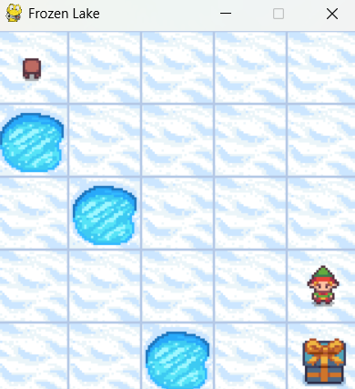

# Homework 01 Report

傅聪 (@congfu)

## $\rm{Q}_1$:仔细阅读整个代码库, 找出目前已有的实现里面, 如何体现 Q learning 的 update formula。把 update formula 拆解成不同的部分, 把源代码中相应的部分粘贴过来。

## $\rm{A}_1$:Q-learning 的更新公式如下：

$$
Q_{t+1} (s_t, a_t) := Q_t(s_t, a_t) + \alpha [r_{t+1} + \gamma\max_{\substack a'} Q(s_{t+1}, a_{t+1}) - Q_t(Q_{t+1}, a_t)]
$$

对应于代码中：

### 首先

```py
from smolrl.agents import QLearningAgent
```

导入了 Q learning 的算法。

### 训练的 agent

```py
agent = QLearningAgent(
            learning_rate=params.learning_rate,
            gamma=params.gamma,
            epsilon=params.epsilon,
            obs_space=env.observation_space,
            action_space=env.action_space,
        )
```

### 更新 Q 值的方法：

```py
agent.update(state, action, reward, new_state)
```

4、更新公式的每一项代码具体实现(in q_learning.py)：

当前的 Q 值 $Q_t(s_t, a_t)$

```py
self.qfunc.get_q_value(state, action)
```

学习率 $\alpha$:

```py
self.learning_rate
```

奖励 $r$ 参数:

```py
reward
```

衰减因子$\gamma$:

```py
self.gamma
```

新状态的最大 Q 值 $\max_{\substack a'} Q(s_{t+1})$:

```py
self.qfunc.max_q_prime(new_state)
```

目标值：

```py
reward + self.gamma * self.qfunc.max_q_prime(new_state)
```

查资料代码里的 $\delta$ 是时序差分误差，表示预测值与目标值的差：

```py
delta = (
    reward
      + self.gamma * self.qfunc.max_q_prime(new_state)
      - self.qfunc.get_q_value(state, action)
)
```

### 总结：

```py
def get_q_func(self):
    return self.qfunc.get()

def calc_q_update(
    self, state: ObsType, action: ActType, reward: Any, new_state: ObsType
):
    delta = (
        reward
        + self.gamma * self.qfunc.max_q_prime(new_state)
        - self.qfunc.get_q_value(state, action)
    )
    q_update = self.qfunc.get_q_value(state, action) + self.learning_rate * delta
    return q_update

def max_q_prime(self, state) -> np.float64:
    return self.qfunc.max_q_prime(state)

def get_qs_for_actions(self, state):
    return self.qfunc.get_qs_for_actions(state)

def update(self, q_update, state, action):
    self.qfunc.update(q_update, state, action)
```

## $\rm{Q}_2$：展示自己的 Frozen Lake 的游戏画面和每个 episode 过程中 steps to goal 和 cumulated rewards 的变化曲线. 思考怎么判断收敛了吗?

## $\rm{A}_2$：




## $\rm{Q}_3$：展示完成一个完整实验后, 得到的统计分析和学习到的 Q Table 和每个状态下的 best action heatmap.

## $\rm{A}_3$：


## $\rm{Q}_4$：比较不同 map size 下 (5, 7, 9, 13), learning converge 的变化情况, Optional: 可以尝试改变一下 proba_frozen / epsilon / is_slippery 等其他参数观察一下区别

## $\rm{A}_4$：


