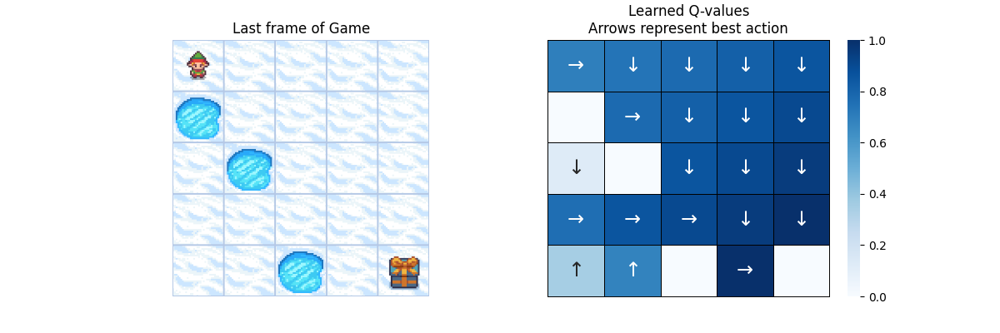
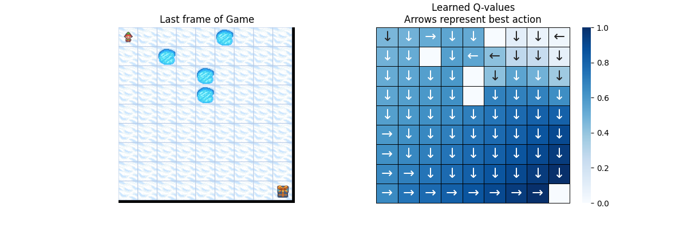

1. 仔细阅读整个代码库, 找出目前已有的实现里面, 如何体现 Q learning 的 update formula。把 update formula 拆解成不同的部分, 把源代码中相应的部分粘贴过来。
$$
\begin{align}
Q_{t+1}(s_t, a_t)
&\gets Q_t(s_t, a_t) + \alpha \big( r_{t+1} + \gamma \cdot \max_{a \in \mathcal A_{s_{t+1}}} Q_t( s_{t+1} , a) - Q_t (s_{t+1}, a_t) \big) \\
&= (1 - \alpha)Q(s_t, a_t) + \alpha (r_{t+1} + \gamma \max_{a \in \mathcal A_{s_{t+1}}} Q_t( s_{t+1} , a))
\end{align}
$$

- $Q(s_t, a_t)$
`self.qfunc.get_q_value(state, action)`
- $\alpha$
`self.learning_rate`
- $\gamma$
`self.gamma`
- $r_{t+1}$
`reward`
- 当前Q值
`self.qfunc.get_q_value(state, action)`
- $\max_{a \in \mathcal A_{s_{t+1}}} Q_t( s_{t+1} , a)$
`self.qfunc.max_q_prime(new_state)`
- Q值更新
`q_update = self.qfunc.get_q_value(state, action) + self.learning_rate * delta`

## 4/23新做的
`is_slippery=false`

`is_slippery=true`

`is_slippery=true proba_frozen=0.5`

`is_slippery=false proba_frozen=0.5 epsilon=0.5`

**map size=11**

**map size=5**

**map size=9**

