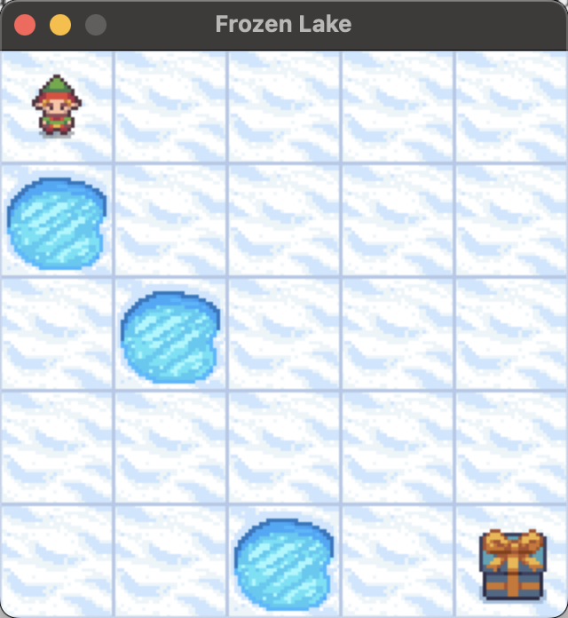
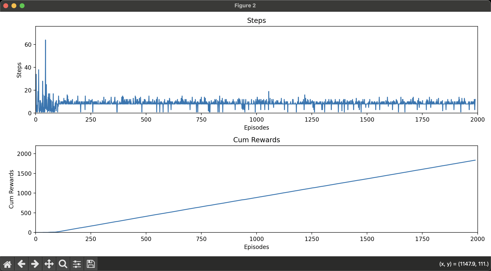
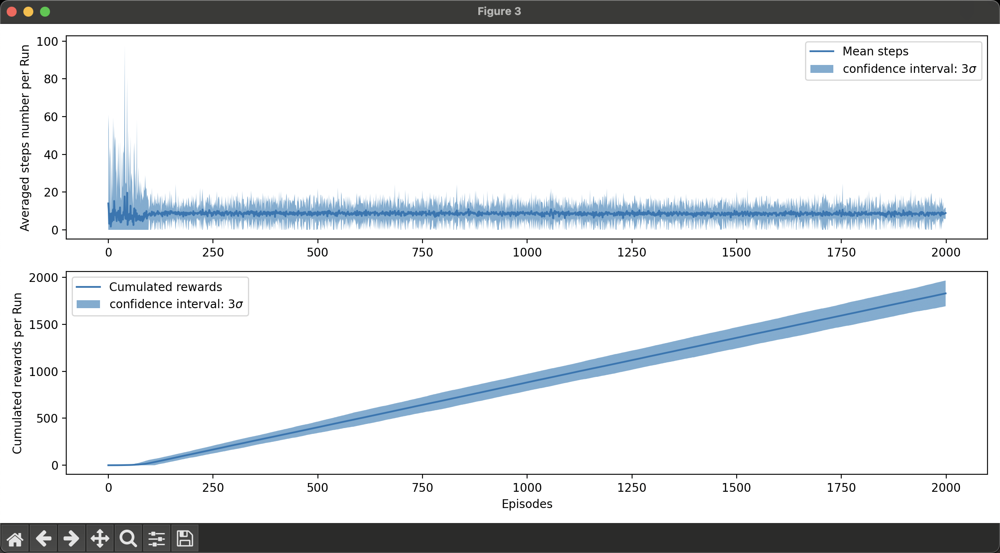
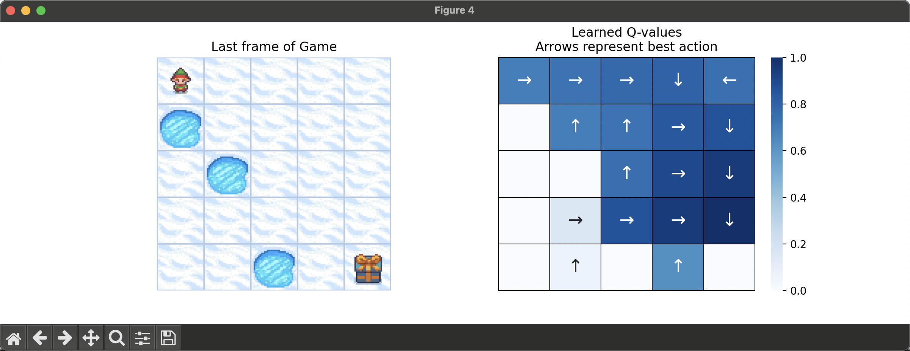
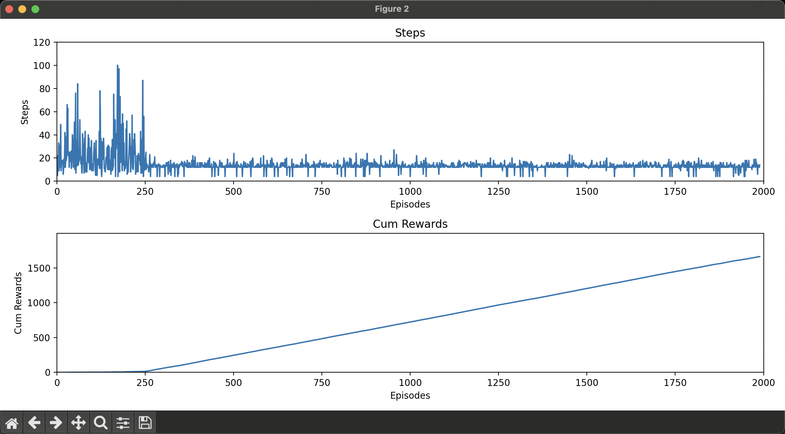
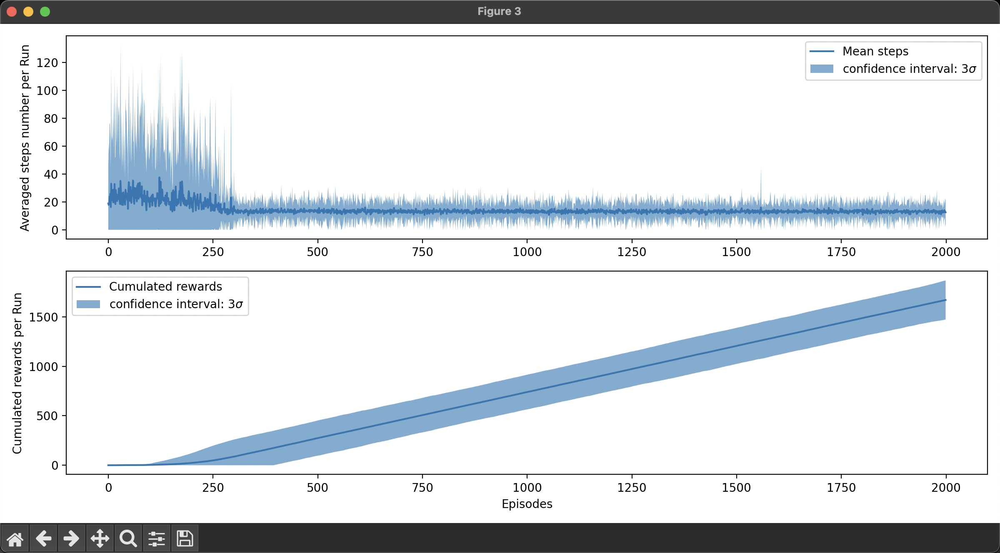
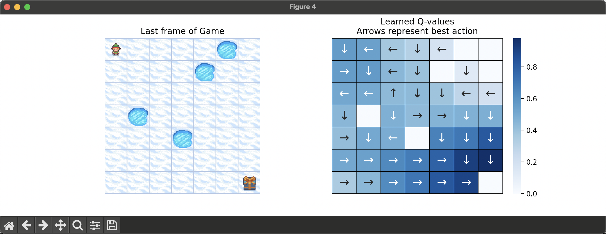
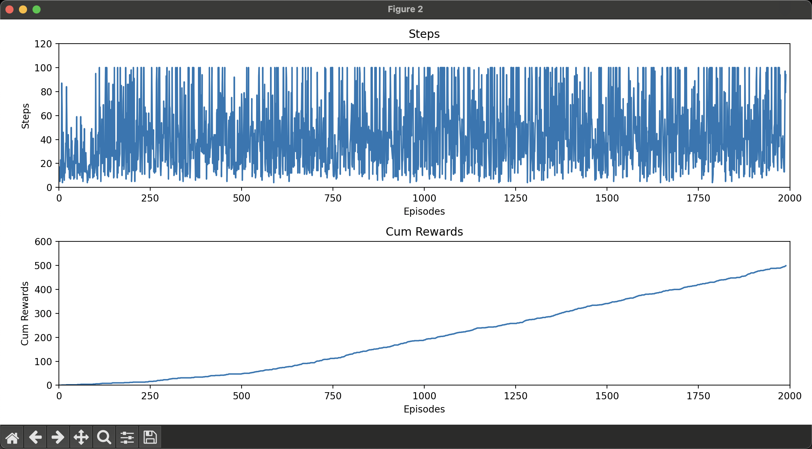
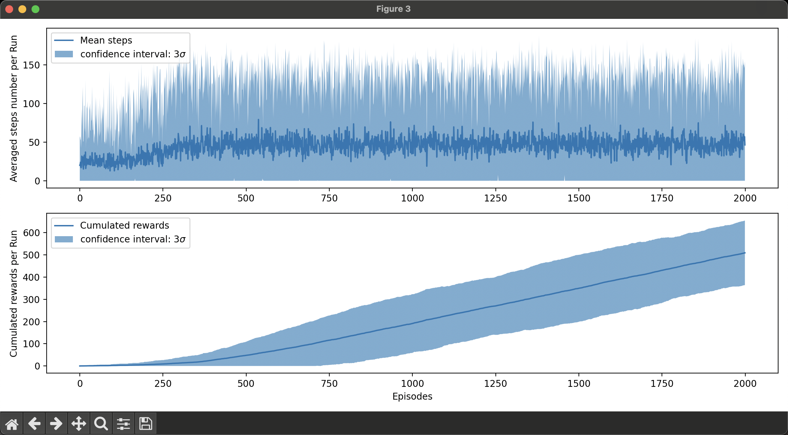
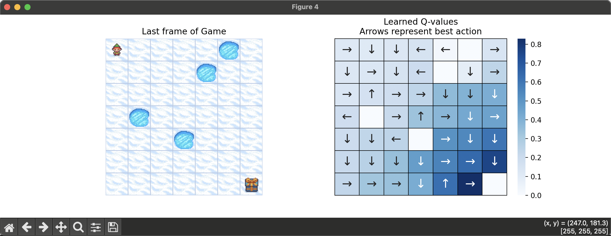

# task01
1. 仔细阅读整个代码库, 找出目前已有的实现里面, 如何体现 Q learning 的 update formula。把 update formula 拆解成不同的部分, 把源代码中相应的部分粘贴过来。

---
formula:
$$
\begin{align}
Q_{t+1}(s_t, a_t)
&\gets Q_t(s_t, a_t) + \alpha \big( r_{t+1} + \gamma \cdot \max_{a \in \mathcal A_{s_{t+1}}} Q_t( s_{t+1} , a) - Q_t (s_{t+1}, a_t) \big) \\
&= (1 - \alpha)Q(s_t, a_t) + \alpha (r_{t+1} + \gamma \max_{a \in \mathcal A_{s_{t+1}}} Q_t( s_{t+1} , a))
\end{align}
$$

## params:
```python
# q_learning.py
class QLearningParams(Generic[ObsType, ActType]):
    obs_space: Space[ObsType]
    action_space: Space[ActType]
    learning_rate: float
    gamma: float
    epsilon: float
```

## value
$Q_t(s_t, a_t)$
```python
# q_learning.py ; class DiscreteQFunc(BaseQFunc):
def get_q_value(self, state, action):
        return self._qtable[state, action]
```
$max$
```python
# q_learning.py ; class DiscreteQFunc(BaseQFunc):
def max_q_prime(self, state):
        return np.max(self._qtable[state, :])
```

## update:
```python
# q_learning ; class Learner(Generic[ObsType, ActType]):
def calc_q_update(
        self, state: ObsType, action: ActType, reward: Any, new_state: ObsType
    ):
        delta = (
            reward
            + self.gamma * self.qfunc.max_q_prime(new_state)
            - self.qfunc.get_q_value(state, action)
        )
        q_update = self.qfunc.get_q_value(state, action) + self.learning_rate * delta
        return q_update
```
---

# task 02

2. 运行

   - `python run_forzen_lake.py --play-mode human --render-mode human`
   - `python run_forzen_lake.py --play-mode agent --render-mode rgb_array --vis`

   展示自己的 Frozen Lake 的游戏画面和每个 episode 过程中 steps to goal 和 cumulated rewards 的变化曲线. 思考怎么判断收敛了吗?

---

`python run_forzen_lake.py --play-mode human --render-mode human`



`python run_forzen_lake.py --play-mode agent --render-mode rgb_array --vis`




---
# task 03

3. 运行 `python run_forzen_lake.py --play-mode agent --render-mode rgb_array`, 展示完成一个完整实验后, 得到的统计分析和学习到的 Q Table 和每个状态下的 best action heatmap.



---
# task 04

4. 比较不同 map size 下 (5, 7, 9, 13), learning converge 的变化情况, Optional: 可以尝试改变一下 `proba_frozen` / `epsilon` / `is_slippery` 等其他参数观察一下区别

## mapsize = 5 
如上

## mapsize = 7




## mapsize = 9
会卡100步out

## mapxsize = 13
也会卡100步out

## is_slippery = True, mapsize = 7
由于打滑，需要的步数会变多，会100out


