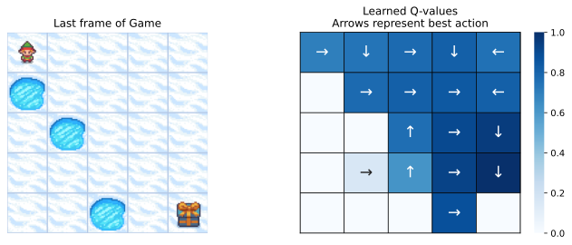
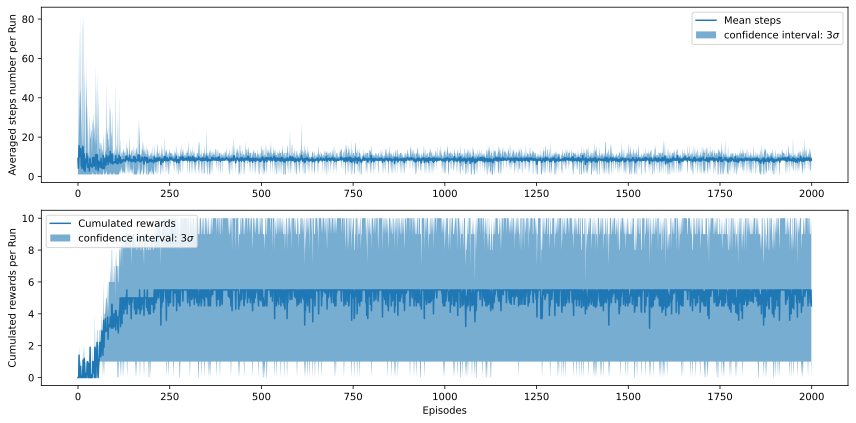
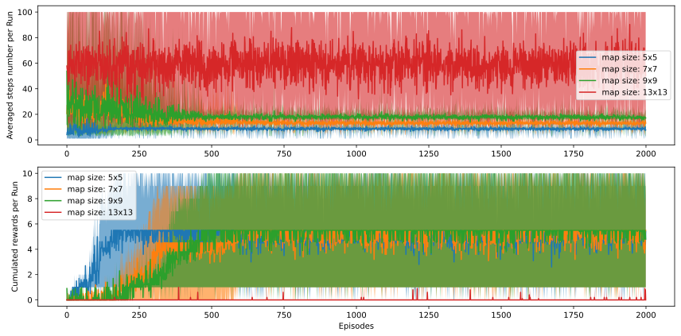

# Report of Homework 01

Author: Lanqing Huang (@lqhuang)

## Question 3

Q: 运行 `python run_forzen_lake.py --play-mode agent --render-mode rgb_array`, 展示完成一个完整实验后, 得到的统计分析和学习到的 Q Table 和每个状态下的 best action heatmap.

A:

## Question 4

Q: 比较不同 map size 下 (5, 7, 9, 13), learning converge 的变化情况, Optional: 可以尝试改变一下 `proba_frozen` / `epsilon` / `is_slippery` 等其他参数观察一下区别

A:

